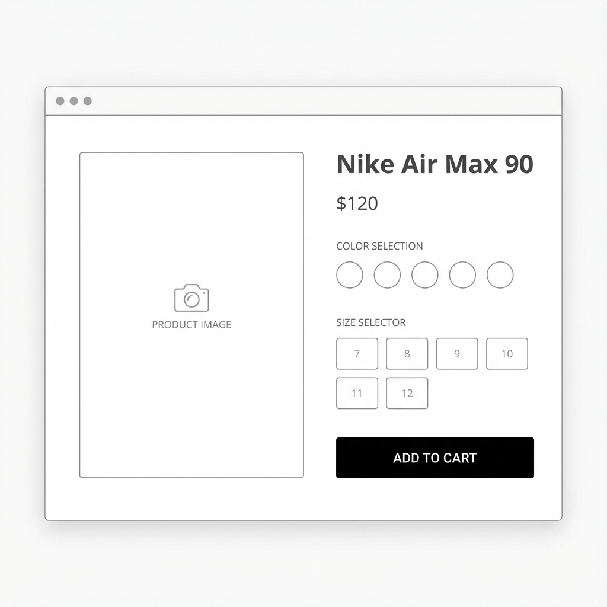
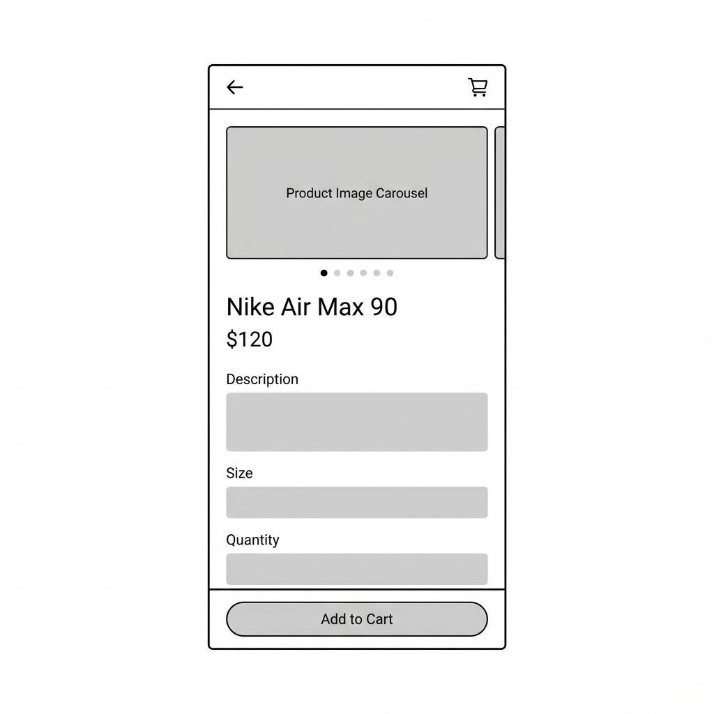

# Feature UI: Product Detail Page
**Feature ID:** FE-PROD-001
**Story:** US-PROD-02

---

## 1. 🎨 Visual Design & Layout

### 1.1. Layout Structure
*   **Desktop (2 Columns):**
    *   **Left (60%):** Gallery ảnh (Main Image + Thumbnail List).
    *   **Right (40%):** Info (Name, Price, Variants, Actions).
*   **Mobile (Stack):**
    *   Image Carousel (Swipeable).
    *   Info bên dưới.

### 1.2. Design Assets
> **AI Note:** Hãy bám sát design dưới đây để implement UI.

**Desktop View:**

**Mobile View:**

*   **Style:** Minimalist, Clean, Whitespace nhiều.
*   **Color:** Primary Black (#000), Accent Blue (#007AFF).
*   **Typography:** Sans-serif (Inter/Roboto).

---

## 2. 🖥️ UI States

### 2.1. Loading State
*   **Skeleton:** Hiển thị khung xám mờ (Shimmer effect) cho Image và Text block.
*   **Duration:** < 1.5s.

### 2.2. Default State (Ready)
*   Hiển thị ảnh đầu tiên.
*   Mặc định chọn Variant đầu tiên còn hàng.
*   Nút "Add to Cart" Enable.

### 2.3. Interaction States
*   **Hover Image:** Zoom in nhẹ (scale 1.1).
*   **Select Variant:** Border đậm quanh Option được chọn.
*   **Add to Cart (Loading):** Button hiển thị Spinner, disable click.

### 2.4. Error State
*   **Out of Stock:** Button chuyển màu xám, text "Out of Stock", disable.
*   **API Error:** Hiển thị Toast Message "Failed to load product".

---

## 3. 🧩 Micro-interactions
*   **Gallery:** Click thumbnail -> Main image thay đổi (Fade effect).
*   **Quantity:** Nút +/- tăng giảm số lượng, không cho giảm dưới 1.
*   **Success:** Khi thêm vào giỏ, icon giỏ hàng trên Header "nhảy" nhẹ (Bounce animation).
